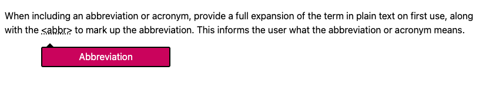

# Abbreviation Tooltip (Vanilla JS)

A lightweight and accessible abbreviation tooltip implemented using vanilla JavaScript. This project provides a simple way to add informative tooltips to abbreviations on your website, enhancing user experience and accessibility.



## Features

*   **Vanilla JS:** No external dependencies required.
*   **Lightweight:** Minimal footprint for optimal performance.
*   **Accessible:** Follows accessibility best practices for screen readers and keyboard navigation.
*   **Customizable:** Easily style the tooltip with CSS.
*   **Simple Integration:** Easy to add to any HTML page.

## Installation

1.  **Download:** Download the `js/main.js` and `css/style.css` files from the repository (perhaps rename the files to fit in your project).
2.  **Include Files:** Include the CSS and JS files in your HTML:

```html
<link rel="stylesheet" href="css/style.css">
<script src="js/main.js" defer></script>
```

## Example
```html
<abbr data-title="Rijksinstituut voor Volksgezondheid en Milieu" data-background="#ca005d" class="tooltip-wrapper" tabindex="0">
    <span class="tooltip-trigger">RIVM</span>
</abbr>
```
